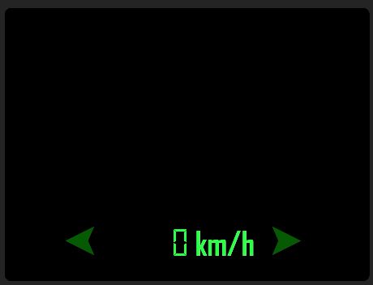

# OpenGL - CarGUI

### SparseDrive ( Detection, VectorMap, Motion planning )


### Other models ( Detection, SegMap )


## Introduction
An on-board display system for autonomous driving, including surrounding traffic environment, front and back camera images, speedometer, turn singal and speed limit reminder.

We use those models to get environment infomation:

- SparseDrive (detection, vector map, motion planning)
- StreamPETR (detection)
- BEVFormer (dectction, segmentation map)


### Available display objects in surronding environment :
- car
- truck
- bus
- pedestrian
- motorcycle
- traffic_cone


## Installation
```
pip install -r requirements.txt
```

Ubuntu requires opencv-headless
```
pip install opencv-python-headless
```

## Usage

###  set configuration 

check config.yaml

draw_mode

- "3d" for 3d bbox only
- "2d" for 2d bbox only
- "seg" (BEVFormer) for segmemtation bev map + 3d bbox
- "vec" (SparseDrive) for vector map + 3d bbox + motion preditcion


ip, port: receiver client ip
 
### data format
one frame data example:<br>
3d mode:
```
{
 'img':{
        'CAM_FRONT': str,
        'CAM_BACK':  str
        },   
 'obj':[{
        'x':    float,
        'y':    float,
        'cls':  str,
        'ang':  float
        }, ...]
 'speed':       float,  # optional
 'steering':    float   # optional
}
```
- img (dict)<br>
all image shape should be resize to (470, 264) and encoded by base64
- obj (list of dicts)<br>
all object of current frame, x y are object world coordinate, and should be normalized to 0 ~ 1, cls is in one of available classes we mention above, ang is object heading angle
- speed (optional)<br>
ego car speed
- steering<br>
ego car steering
